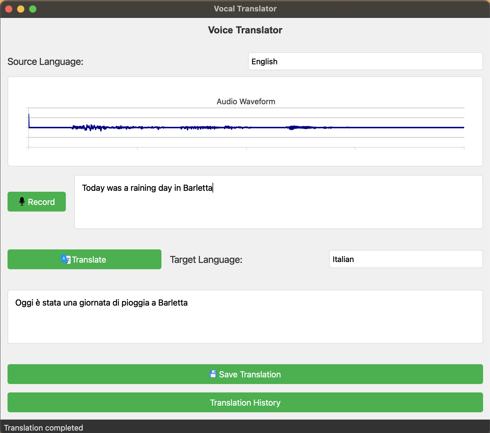
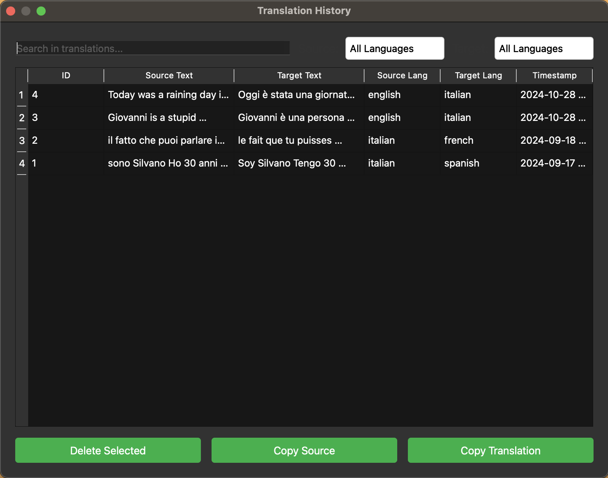

# 🎙️ Advanced Voice Translator with Multilingual Support

A sophisticated PyQt6-based application that combines speech recognition, multilingual translation, and database management to create a powerful translation tool. The application features real-time audio visualization, bidirectional translation support, and a comprehensive translation history system.



## 🌟 Features

The Voice Translator offers a comprehensive set of features designed to make translation seamless and efficient:

- **Speech Recognition and Visualization**: 
  - Real-time audio waveform display during recording
  - Silence detection and automatic audio cleanup
  - High-accuracy speech-to-text conversion optimized

- **Multilingual Translation System**: 
  - Support for bidirectional translation between multiple languages
  - Pre-trained neural models for high-quality translations
  - Language auto-detection capabilities

- **Translation Management**:
  - Searchable database of all translations
  - Advanced filtering and search capabilities
  - Intuitive history interface for managing past translations

## 🏗️ Architecture and Technical Implementation

### Object-Oriented Design and Modularity

The project follows a carefully planned modular architecture that separates concerns and promotes code reusability. Each component is designed as an independent module that communicates through well-defined interfaces:

- **GUI Module**: Handles all user interface components, implementing the Model-View-Controller pattern. The main window and history window are separate classes that inherit from PyQt6 base classes, ensuring clean separation of UI logic.

- **Audio Processing Module**: Manages all audio-related functionality, from capturing input to processing the signal. It uses dependency injection to remain independent of specific audio processing implementations.

- **Translation Module**: Encapsulates all translation logic, providing a clean interface to the neural models while hiding the complexity of model management and tokenization.

- **Database Module**: Handles data persistence with a repository pattern, abstracting the database operations from the rest of the application.

### Hugging Face Integration and Neural Translation

The translation system leverages Hugging Face's transformers library to provide state-of-the-art neural machine translation:

- **Model Architecture**: Uses the Helsinki-NLP's OPUS-MT models, which are based on the Transformer architecture and trained on millions of parallel sentences.

- **Efficient Model Management**: Implements lazy loading of models to optimize memory usage. Models are loaded only when needed and cached for subsequent use.

- **Pipeline Processing**: Translation requests go through a sophisticated pipeline that handles:
  - Text normalization and preprocessing
  - Tokenization specific to each language pair
  - Batch processing for efficient translation
  - Post-processing and detokenization

### Database System and History Management

The application implements a robust SQLite3-based storage system with a focus on performance and usability:



The database architecture includes:

- **Optimized Schema Design**: Carefully designed tables with appropriate indexes for fast querying and efficient storage.

- **Connection Management**: Implementation of connection pooling and proper transaction handling to ensure data integrity.

- **Query Optimization**: Prepared statements and optimized queries for fast search and retrieval operations.

The history interface provides:

- **Real-time Search**: Instant search results as users type, implemented with debouncing for performance.
- **Advanced Filtering**: Multi-criteria filtering system for source and target languages.
- **Efficient Data Display**: Virtual scrolling for handling large numbers of translations efficiently.

## 💻 Requirements

- Python 3.7+
- PyQt6 and PyQt6-Charts
- SpeechRecognition
- transformers
- torch
- pydub
- sqlite3

## 🚀 Installation

1. Clone the repository:
```bash
git clone https://github.com/Silvano315/GUI-Voice-Translator-from-Italian.git
```

2. Navigate to project directory:
```bash
cd GUI-Voice-Translator-from-Italian
```

3. Install dependencies:
```bash
pip install -r requirements.txt
```

## 📖 Usage

1. Start the application:
```bash
python main_translator.py
```

2. Using the translator:
   - Select your desired source and target languages
   - Click "Record" and speak clearly (you'll see the audio waveform)
   - The recognized text will appear automatically
   - Click "Translate" to get your translation
   - Save translations you want to keep for later reference

3. Managing translations:
   - Access your translation history through the history button
   - Use the search bar to find specific translations
   - Filter by language pairs
   - Copy or delete translations as needed

## 🤝 Contributing

1. Fork the repository
2. Create your feature branch (`git checkout -b feature/AmazingFeature`)
3. Commit your changes (`git commit -m 'Add some AmazingFeature'`)
4. Push to the branch (`git push origin feature/AmazingFeature`)
5. Open a Pull Request

## 🙏 Acknowledgments

- Hugging Face for providing the transformer models
- Helsinki-NLP for the multilingual translation models
- PyQt team for the GUI framework
- Google Speech Recognition API for speech-to-text capabilities